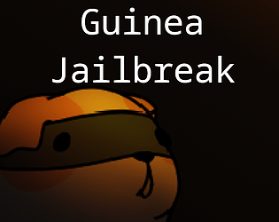

# Guinea Jailbreak

if exists, [Itch.Io Link](https://komugi1211s.itch.io/guinea-jailbreak)

## Information
 - **Art, Design, Code, Music** by me.
 - written in **C, C++** (using **Raylib** library).
 - Project Time: **2022-09-02** ~ **2022-09-06**

## About
**Strategy game about freeing captured guinea pig friends from the evil hamster organization.**

Developed in 4 days for a [Interstellar Game Jam 3](https://itch.io/jam/interstellar-game-jam-3), with the theme of _Defy the Law_.  
Ranked **2th** place out of 15 entries.
