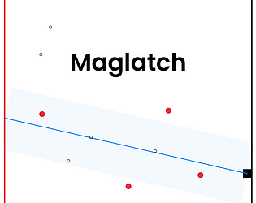

# Maglatch

[Github Link](https://github.com/komugi1211s/BlackAndWhiteJam-RingBuf)
[Itch.Io Link](https://komugi1211s.itch.io/maglatch)

## Information
 - **Art, Design, Code, Music** by me.
 - written in **C, C++** (using **Raylib** library).
 - Project Time: **2022-04-31** ~ **2022-05-02**

## About

**Pseudo Bullet-hell game with magnetic system, where the movement and attack are stuck into one. fight against the horde of enemies, keep the combo intact, never stop moving.**

Developed in 2 days for a [ScorespaceJam #18](https://itch.io/jam/scorejam18), with the theme of _Magnet_.  
Ranked **31th** place out of 123 entries.
