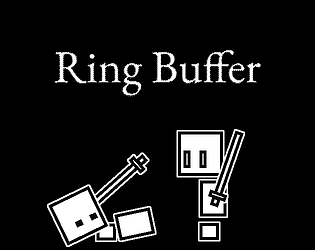

# Ring Buffer

[Github Link](https://github.com/komugi1211s/BlackAndWhiteJam-RingBuf)
[Itch.Io Link](https://komugi1211s.itch.io/ring-buffer-jam-game)

## Information
 - **Art, Design, Code, Music** by me.
 - written in **C, C++** (using **Raylib** library).
 - Project Time: **2022-04-04** ~ **2022-04-12**

## About

**Puzzle-RPG hybrid about desparate robots with malfunctioning memory, fighting against other robots (with malfunctioning memory).**

Developed in 7 days for a [Black and White Jam 8](https://itch.io/jam/black-and-white-jam-8), with the theme of _Loop_.  
Ranked **7th** place out of 350 entries.
