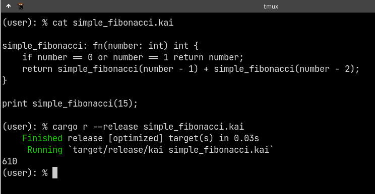

# Unnamed Scripting Language

[Github Link](https://github.com/komugi1211s/rusty_script)

## About

**Toy scripting language written in Rust, mainly as a learning experience and my own enjoyment.**

My own attempt of following [Crafting Interpreter](http://craftinginterpreters.com/), a popular book for writing own toy interpreter.  
eventually I started to deviate from the book's chapter, trying to implement a system in my own way.

