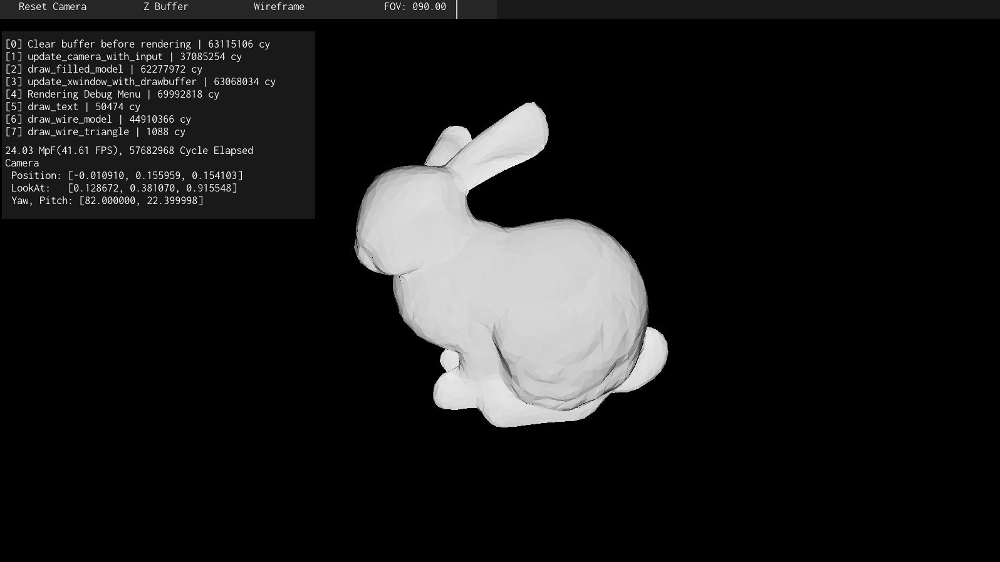

# Tiny Renderer Implementation

[Github Link](https://github.com/komugi1211s/RendererForFun)

## Information
 - Written in C++.
 - feature includes: performance measuring / debug menu, immediate mode GUI.

## About
**my own (futile) attempt of implementing software rasterizer, a product of following [tiny-renderer](https://github.com/ssloy/tinyrenderer) course.**

implemented in about 2 months span, initially began to purely follow the material of the course.  
just like I did in rust toy language, I eventually started to deviate from the oiriginal chapter, and started implementing features in my own way.
