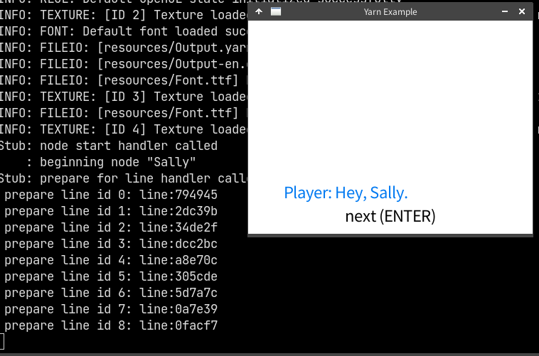

# Yarn Spinner C99 Runtime

[Github Link](https://github.com/komugi1211s/yarn-c99)

## About

C99 port of [Yarn Spinner](https://yarnspinner.dev/)'s Runtime, a tool for writing game dialogue.  
written for integrating into my own game development.  
**this project is not associated with the owner/developer of Yarn Spinner.**

### Feature
 - API contained in a single header, which makes it easy to integrate. (although currently depends on protobuf, which is unavoidable.)
 - reads a set of `yarnc` + `CSV` files.
 - register C functions into Yarn Spinner easily, done in a way similar to Lua.
 - original implementation of hashmap, usable in user space.
 - original implementation of memory allocator, usable in user space.
